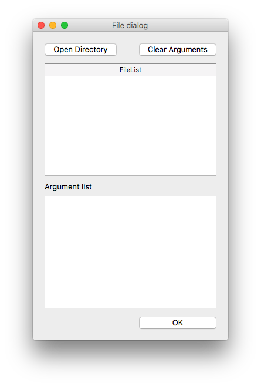

QtArgumentSelector
===

QtArgumentSelector is a simple GUI arguments selector for Python. 

This Program can work in Windows/Linux/MacOS.


## Demo
Let's launch a Program.



Click _Open Direcory_ Button.


You can see files in selected directory.


When you select _Extension_ box, files can be filtered by file extension.


Select cells and click _Select Items_. This Program is closed and your scripts will start.At that time, selected data has been added to the _sys.argv_


### In sys.argv
	['/Users/ryo/Repositories/QtArgumentSelector/test.py', 'Chino.png', 'Cocoa.png']


## Installation
	$git clone https://github.com/drilldripper/QtArgumentSelector.git
	
	
or copy _argument_selector.py_ to your project.


## Usage
Add this script to leading of the file.

```python
from argument_selector import ArgumentSelector
from PyQt5.QtWidgets import (QApplication)
import sys

# Launch PyQt Application
app = QApplication(sys.argv)
# Instantiate GUI
ex = ArgumentSelector()
app.exec_()

```

GUI will launch.

I recommend to check the _sys.argv_.

```python
# Check Arguments
print(sys.argv)

```


## Requirement
- Python 3
- PyQt 5


## Licence
MIT License

## Author
[drilldripper](https://github.com/drilldripper)