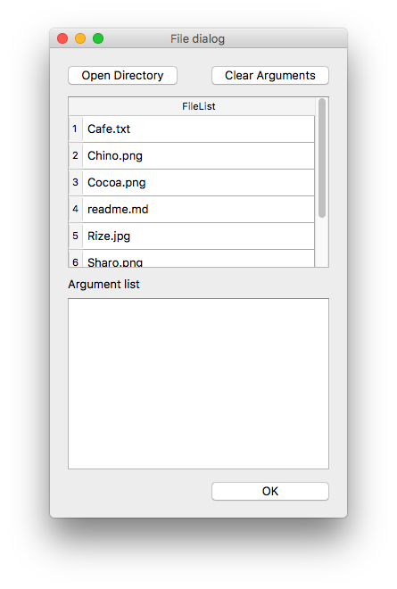
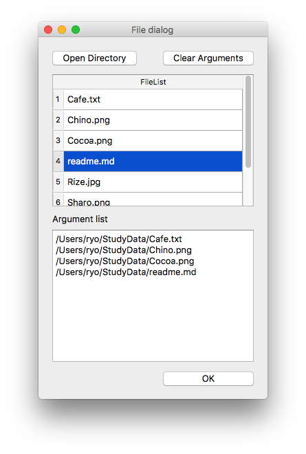

QtArgSelector
===

QtArgSelector is a simple GUI arguments selector for Python. 

This Program can work in Windows/Linux/MacOS.


## Demo
Let's start a Program.


Click `Open Direcory` Button.


Selected directory files is displayed.




Select cells and add to Argument list.



If you want to remove argument list, you can click `Clear Arguments`


Click `OK`.Then this program is closed and your program will start. And selected argument is added to `sys.argv`.


Also,when you will restat this program, argument history was selected.So you can rapidly exec your program.


## Installation
	$pip install QtArgSelector


## Usage
```python
import sys
from qtargs import QtArgSelector


QtArgSelector.ShowArgumentSelector() # Launch GUI
print(sys.argv) # Check Arguments

```


## Requirement
- Python 3 or above
- PyQt 5


## Licence
MIT License

## Author
[drilldripper](https://github.com/drilldripper)
